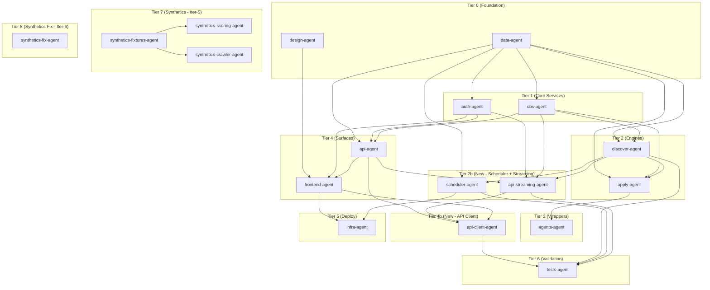

# Talent Agent Cellular Execution Map

> **Gating model:** Max-concurrency tree. Gating = **contract freeze** (not fruit completion). Every leaf is its own Claude Agent SDK session on its own branch. Specialists consume frozen contract stubs, not upstream code; integration happens at merge time via deterministic merge order, not execution time.

---

## Concurrency Math

| Depth | Count | Description |
|---|---|---|
| Biomes (1) | 18 | 14 iter-4 + 3 iter-5 (synthetics) + 1 iter-6 (synthetics-fix) |
| Specialists (2) | ~51 | After iter-6 decomposition |
| Leaf specialists (3) | ~81 | Including iter-6 leaves |
| **Total concurrent sessions at peak** | **3** | Current (iter-6 rate-limit discipline) |
| **Target peak (full depth-3)** | **8-12** | After cache warmup + token bucket optimization |

**Iter-6 deltas:**
- +1 new biome: synthetics-fix-agent (surgical patch)
- +6 new specialists for UUID detection fix
- Iter-5's 17 biomes are frozen — no modifications allowed
- Concurrency tuned down to `-c 3` due to contract-amendment leaf dependency

---

## Gating Semantics

**Old wave-gating (deprecated):** Biome A must reach FRUIT_READY before Biome B can GERMINATE. This serializes execution, wasting concurrency budget on blocking waits.

**New contract-freeze gating:** All contracts freeze upfront. Specialists read frozen stubs from NUTRIENTS.md, not live code from upstream biomes. Biome A and Biome B can germinate, grow, and fruit concurrently. Integration happens at merge time: the deterministic `merge_order` in mycelium.yaml ensures A lands before B when B depends on A's exports.

**Implication:** The tree below shows logical dependencies, not execution order. Every agent can run concurrently from GERMINATE through FRUIT once its `blocked_by` contracts are frozen—which happens before cultivation starts.

---

## Execution Tree

```
organism: talent-agent (iter-6)
│
├── data-agent (4 specialists) — FROZEN
│   ├── data-agent.migrations
│   │   ├── data-agent.migrations.init
│   │   ├── data-agent.migrations.discovery
│   │   ├── data-agent.migrations.application
│   │   └── data-agent.migrations.auth
│   ├── data-agent.models
│   │   ├── data-agent.models.base
│   │   ├── data-agent.models.discovery
│   │   ├── data-agent.models.application
│   │   └── data-agent.models.auth
│   ├── data-agent.schemas-discovery
│   │   └── data-agent.schemas-discovery.all
│   └── data-agent.schemas-application
│       └── data-agent.schemas-application.all
│
├── design-agent (3 specialists) — FROZEN
│   ├── design-agent.tokens
│   │   ├── design-agent.tokens.palette
│   │   ├── design-agent.tokens.typography
│   │   └── design-agent.tokens.spacing
│   ├── design-agent.primitives
│   │   ├── design-agent.primitives.status-badge
│   │   └── design-agent.primitives.stat-card
│   └── design-agent.docs
│       ├── design-agent.docs.cheatsheet
│       └── design-agent.docs.reference
│
├── auth-agent (2 specialists) — FROZEN
│   ├── auth-agent.magic-link
│   │   ├── auth-agent.magic-link.request
│   │   ├── auth-agent.magic-link.verify
│   │   └── auth-agent.magic-link.resend
│   └── auth-agent.jwt
│       ├── auth-agent.jwt.issue
│       ├── auth-agent.jwt.validate
│       └── auth-agent.jwt.current-user
│
├── obs-agent (2 specialists) — FROZEN
│   ├── obs-agent.logging
│   │   ├── obs-agent.logging.config
│   │   └── obs-agent.logging.pii-redact
│   └── obs-agent.pubsub
│       ├── obs-agent.pubsub.taxonomy
│       └── obs-agent.pubsub.publisher
│
├── discover-agent (6 specialists) — FROZEN
│   ├── discover-agent.identity
│   │   └── discover-agent.identity.profiler
│   ├── discover-agent.archetype
│   │   └── discover-agent.archetype.generator
│   ├── discover-agent.crawler
│   │   ├── discover-agent.crawler.greenhouse
│   │   ├── discover-agent.crawler.lever
│   │   ├── discover-agent.crawler.ashby
│   │   └── discover-agent.crawler.workday
│   ├── discover-agent.scorer
│   │   └── discover-agent.scorer.relevance
│   ├── discover-agent.digest
│   │   └── discover-agent.digest.builder
│   ├── discover-agent.orchestrator
│   │   └── discover-agent.orchestrator.main
│   └── discover-agent.pubsub
│       └── discover-agent.pubsub.status-events
│
├── apply-agent (7 specialists) — FROZEN
│   ├── apply-agent.jd-parser
│   │   └── apply-agent.jd-parser.main
│   ├── apply-agent.resume-tailor
│   │   └── apply-agent.resume-tailor.main
│   ├── apply-agent.company-intel
│   │   └── apply-agent.company-intel.main
│   ├── apply-agent.contact-finder
│   │   └── apply-agent.contact-finder.main
│   ├── apply-agent.outreach
│   │   └── apply-agent.outreach.composer
│   ├── apply-agent.auto-apply
│   │   ├── apply-agent.auto-apply.greenhouse
│   │   ├── apply-agent.auto-apply.lever
│   │   ├── apply-agent.auto-apply.ashby
│   │   └── apply-agent.auto-apply.workday
│   └── apply-agent.orchestrator
│       └── apply-agent.orchestrator.main
│
├── agents-agent (3 specialists) — FROZEN
│   ├── agents-agent.registry
│   │   └── agents-agent.registry.defaults
│   ├── agents-agent.runner
│   │   ├── agents-agent.runner.execute
│   │   └── agents-agent.runner.retry
│   └── agents-agent.dispatcher
│       └── agents-agent.dispatcher.pipeline
│
├── api-agent (4 specialists) — FROZEN
│   ├── api-agent.core
│   │   ├── api-agent.core.main
│   │   ├── api-agent.core.config
│   │   └── api-agent.core.database
│   ├── api-agent.routers
│   │   ├── api-agent.routers.discovery
│   │   ├── api-agent.routers.application
│   │   └── api-agent.routers.review
│   ├── api-agent.onboarding
│   │   └── api-agent.onboarding.resume-profile
│   └── api-agent.health
│       └── api-agent.health.endpoint
│
├── scheduler-agent (4 specialists) — FROZEN
│   ├── scheduler-agent.app
│   │   └── scheduler-agent.app.celery-factory
│   ├── scheduler-agent.tasks
│   │   └── scheduler-agent.tasks.daily-discovery
│   ├── scheduler-agent.beat
│   │   └── scheduler-agent.beat.schedule
│   └── scheduler-agent.retry
│       └── scheduler-agent.retry.exponential-backoff
│
├── api-streaming-agent (4 specialists) — FROZEN
│   ├── api-streaming-agent.events
│   │   └── api-streaming-agent.events.endpoint
│   ├── api-streaming-agent.subscriber
│   │   └── api-streaming-agent.subscriber.redis-pubsub
│   ├── api-streaming-agent.heartbeat
│   │   └── api-streaming-agent.heartbeat.ping
│   └── api-streaming-agent.backpressure
│       └── api-streaming-agent.backpressure.slow-client
│
├── frontend-agent (6 specialists) — FROZEN
│   ├── frontend-agent.primitives
│   │   ├── frontend-agent.primitives.button
│   │   ├── frontend-agent.primitives.input
│   │   ├── frontend-agent.primitives.card
│   │   └── frontend-agent.primitives.dialog
│   ├── frontend-agent.layout
│   │   ├── frontend-agent.layout.sidebar
│   │   └── frontend-agent.layout.dashboard
│   ├── frontend-agent.auth-flow
│   │   ├── frontend-agent.auth-flow.login
│   │   ├── frontend-agent.auth-flow.verify
│   │   └── frontend-agent.auth-flow.context
│   ├── frontend-agent.onboarding
│   │   └── frontend-agent.onboarding.wizard
│   ├── frontend-agent.dashboard
│   │   ├── frontend-agent.dashboard.overview
│   │   ├── frontend-agent.dashboard.pipeline
│   │   └── frontend-agent.dashboard.analytics
│   └── frontend-agent.review-queue
│       ├── frontend-agent.review-queue.list
│       └── frontend-agent.review-queue.detail
│
├── api-client-agent (7 specialists) — FROZEN
│   ├── api-client-agent.client
│   │   └── api-client-agent.client.fetch-wrapper
│   ├── api-client-agent.auth
│   │   └── api-client-agent.auth.magic-link
│   ├── api-client-agent.discovery
│   │   └── api-client-agent.discovery.digest-api
│   ├── api-client-agent.applications
│   │   └── api-client-agent.applications.review-api
│   ├── api-client-agent.events
│   │   └── api-client-agent.events.sse-subscription
│   ├── api-client-agent.error-handling
│   │   └── api-client-agent.error-handling.401-logout
│   └── api-client-agent.page-wiring
│       └── api-client-agent.page-wiring.data-integration
│
├── infra-agent (6 specialists) — FROZEN
│   ├── infra-agent.docker.backend
│   │   └── infra-agent.docker.backend.dockerfile
│   ├── infra-agent.docker.frontend
│   │   └── infra-agent.docker.frontend.dockerfile-nginx
│   ├── infra-agent.docker.compose
│   │   └── infra-agent.docker.compose.six-services
│   ├── infra-agent.ecs.task-defs
│   │   ├── infra-agent.ecs.task-defs.backend
│   │   ├── infra-agent.ecs.task-defs.frontend
│   │   ├── infra-agent.ecs.task-defs.celery-worker
│   │   └── infra-agent.ecs.task-defs.celery-beat
│   ├── infra-agent.ecs.bootstrap
│   │   └── infra-agent.ecs.bootstrap.setup-aws
│   └── infra-agent.pipeline.digital-dash
│       └── infra-agent.pipeline.digital-dash.deploy-celery
│
├── tests-agent (5 specialists) — FROZEN
│   ├── tests-agent.discovery.pubsub
│   │   └── tests-agent.discovery.pubsub.event-sequence
│   ├── tests-agent.scheduler.daily
│   │   └── tests-agent.scheduler.daily.task-creation
│   ├── tests-agent.api.events
│   │   └── tests-agent.api.events.sse-frames
│   ├── tests-agent.api.review
│   │   └── tests-agent.api.review.approve-flow
│   └── tests-agent.frontend.client
│       └── tests-agent.frontend.client.auth-injection
│
├── synthetics-fixtures-agent (4 specialists) ← NEW BIOME
│   ├── synthetics-fixtures-agent.candidates
│   │   └── synthetics-fixtures-agent.candidates.yaml-definitions
│   ├── synthetics-fixtures-agent.jobs
│   │   └── synthetics-fixtures-agent.jobs.jd-markdown-files
│   ├── synthetics-fixtures-agent.baselines
│   │   └── synthetics-fixtures-agent.baselines.gitignore-scaffold
│   └── synthetics-fixtures-agent.seeder
│       └── synthetics-fixtures-agent.seeder.idempotent-upsert
│
├── synthetics-scoring-agent (5 specialists) ← NEW BIOME
│   ├── synthetics-scoring-agent.runner
│   │   └── synthetics-scoring-agent.runner.suite-orchestration
│   ├── synthetics-scoring-agent.fingerprint
│   │   └── synthetics-scoring-agent.fingerprint.stable-json
│   ├── synthetics-scoring-agent.diff
│   │   └── synthetics-scoring-agent.diff.baseline-comparison
│   ├── synthetics-scoring-agent.cli
│   │   └── synthetics-scoring-agent.cli.run-command
│   └── synthetics-scoring-agent.cache-verification
│       └── synthetics-scoring-agent.cache-verification.hit-rate-check
│
├── synthetics-crawler-agent (4 specialists) — FROZEN
│   ├── synthetics-crawler-agent.runner
│   │   └── synthetics-crawler-agent.runner.health-check
│   ├── synthetics-crawler-agent.schemas
│   │   └── synthetics-crawler-agent.schemas.expected-shapes
│   ├── synthetics-crawler-agent.state-machine
│   │   └── synthetics-crawler-agent.state-machine.consecutive-failures
│   └── synthetics-crawler-agent.beat-extension
│       └── synthetics-crawler-agent.beat-extension.hourly-schedule
│
└── synthetics-fix-agent (6 specialists) ← ITER-6 BIOME
    ├── synthetics-fix-agent.known-ids
    │   └── synthetics-fix-agent.known-ids.canonical-uuids
    ├── synthetics-fix-agent.scoring-runner-detection
    │   └── synthetics-fix-agent.scoring-runner-detection.sql-any
    ├── synthetics-fix-agent.seeder-self-verify
    │   └── synthetics-fix-agent.seeder-self-verify.uuid-check
    ├── synthetics-fix-agent.candidates-yaml-cleanup
    │   └── synthetics-fix-agent.candidates-yaml-cleanup.header-comment
    ├── synthetics-fix-agent.contract-amendment
    │   └── synthetics-fix-agent.contract-amendment.nutrients-i1b
    └── synthetics-fix-agent.tests
        ├── synthetics-fix-agent.tests.known-ids
        └── synthetics-fix-agent.tests.seeder-idempotent
```

---

## Dependency Graph (Mermaid)



---

## What's Next

1. **Iter-6 verification gates** (current work)
   - Run 5 verification gates from brief
   - Capture artifacts in `synthetics/runs/iter-6-verification/`
   - Accept first baseline via manual copy (CLI lands in iter-7)

2. **Mycelium synthetics CLI** (iter-7)
   - `mycelium synthetics baseline accept <run_id>`
   - Promote drift contract template to framework
   - Alert state machine abstraction

3. **Deploy synthetics to production** (iter-8+)
   - Run `deploy/setup-aws.sh` to stand up ECS
   - Flip `synthetics.target: remote` in mycelium.yaml
   - Workday monitoring via different architecture (webhook-driven, sampled, or replay-based)

4. **Synthetic dashboard UI** (+3 specialists)
   - `/synthetics` route showing recent runs, drift reports, crawler health
   - Real-time SSE subscription to `agent.status.synthetics.*` channels

5. **Expand synthetic candidate coverage** (+1 specialist)
   - Add edge-case candidates (career changers, gap years, non-traditional backgrounds)
   - Stress-test archetype generator

---

## Parked for Later

- **Rate-limit tuning:** Currently locked at `-c 4` per framework evidence. Re-evaluate once cache hit-rate is consistently >80%.
- **Circuit breakers:** Add backpressure mechanisms if any specialist consistently fails.
- **Cost tracking:** Token usage per leaf for budget forecasting.
- **Incremental freeze:** Allow mid-cultivation contract amendments without full re-freeze.
- **Event sourcing:** Full event replay for SSE connections.
- **Multi-tenant isolation:** Agency-level candidate partitioning (post-MVP).
- **Workday hourly health checks:** Currently daily only; Playwright cost prohibitive for hourly.
